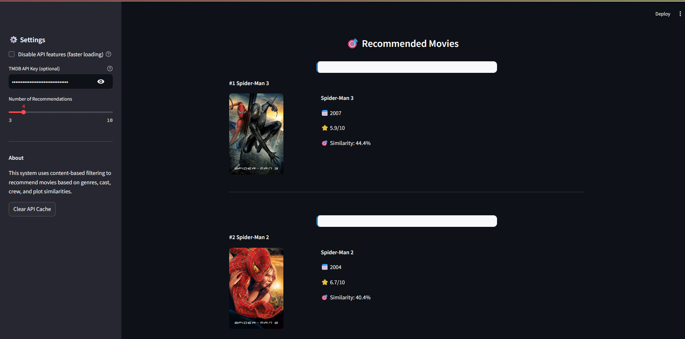

# 🎬 Movie Recommendation System

## 🎯 Problem Definition
This Movie Recommendation System helps users discover movies they are likely to enjoy based on content similarity. It analyzes key features such as:
- Genres
- Keywords
- Cast and crew
- Movie overviews
- Ratings and popularity

The system is designed to assist users in navigating large movie catalogs and finding relevant recommendations quickly and easily.

## ❓ Why This Problem
- The number of movies available online is overwhelming for most users.
- Users often miss out on great movies due to lack of discovery tools.
- Personalized recommendations improve user satisfaction and engagement.
- Content-based filtering allows recommendations even for new or unrated movies.

## 🚀 Approach
1. 📥 **Data Loading & Preprocessing**
   - Load and merge `movies_metadata.csv`, `credits.csv`, and `keywords.csv` from the Kaggle Movies Dataset.
   - Parse and clean genres, keywords, cast, crew, and overview fields.
   - Filter to the top 5000 most popular movies for performance.
2. 📊 **Exploratory Data Analysis (EDA) & Visualization**
   - Visualize genre distribution, rating histogram, and release year trends using Plotly and Streamlit.
3. 🧾 **Feature Engineering**
   - Combine genres, keywords, cast, crew, and overview into a single 'tags' feature for each movie.
   - Use CountVectorizer to create feature vectors for all movies.
4. 🤖 **Recommendation Engine**
   - Compute cosine similarity between all movie vectors.
   - For a selected movie, recommend the most similar movies (excluding itself).
   - Display recommendations with posters, genres, ratings, and release years.
5. 🖥️ **User Interface**
   - Streamlit app with autocomplete search, Get Recommendations button, and interactive visualizations.
   - Optional TMDB API integration for movie posters.

## ✅ Final Solution
- The app provides fast, content-based movie recommendations with a modern, user-friendly interface.
- Users can search, filter, and explore recommendations with rich metadata and visuals.

## 🛠️ Technologies Used
- **Python 3**
- **Pandas, NumPy** – Data manipulation
- **Scikit-learn** – Feature engineering and similarity computation
- **Streamlit** – Web app and UI
- **Plotly** – Interactive data visualization
- **TMDB API** – Movie posters (optional)

## 📁 Project Structure
```
ml/
├── app.py                  # Streamlit UI and main app logic
├── movie_recommender.py    # Data loading, preprocessing, recommendation, and visualization logic
├── requirements.txt        # Python dependencies
├── README.md               # Project documentation
├── images/                 # App screenshots and visual assets
│   ├── homepage.png        # Home page screenshot
│   ├── Recommended1.png    # Recommendations example 1
│   ├── Recommended2.png    # Recommendations example 2
│   └── datainsights.png    # Data insights screenshot
├── movies_metadata.csv     # Kaggle movie metadata (downloaded separately)
├── credits.csv             # Kaggle movie cast/crew (downloaded separately)
└── keywords.csv            # Kaggle movie keywords (downloaded separately)
```
- Place the three CSV files in the project folder as shown above.
- All code and logic is in `app.py` and `movie_recommender.py`.
- The `images/` folder contains screenshots for documentation.
- No other files are required for the app to run.

## 📦 Dataset Details
This project uses the [Kaggle Movies Dataset](https://www.kaggle.com/datasets/rounakbanik/the-movies-dataset), which includes:
- **movies_metadata.csv**: Main movie information (title, genres, overview, release date, ratings, etc.)
- **credits.csv**: Cast and crew for each movie (as JSON strings)
- **keywords.csv**: Keywords/tags for each movie (as JSON strings)

**How to set up:**
1. Download the dataset from [Kaggle](https://www.kaggle.com/datasets/rounakbanik/the-movies-dataset) or from this [Google Drive link](https://drive.google.com/drive/folders/17fapo4ExZJaDgyqEp_osUXT2qs2f0u4T?usp=sharing).
2. Place `movies_metadata.csv`, `credits.csv`, and `keywords.csv` in your project folder.
3. The app will automatically use these files for recommendations.

## ⚡ Performance Note
- Only the top 5000 most popular movies (by vote count) are used by default for speed and to avoid memory errors. You can change this number in `movie_recommender.py`.
- Using more movies will require more RAM and may slow down recommendations.

## 🚀 How to Run
1. **Install dependencies:**
   ```bash
   pip install -r requirements.txt
   ```
2. **Run the application:**
   ```bash
   streamlit run app.py
   ```
3. **Open your browser** and go to `http://localhost:8501`

## 🔑 TMDB API Setup (Optional)
- You only need a TMDB API key if you want to see movie posters in the recommendations.
- If you do not enter an API key, the app will still work and simply show placeholder images instead of posters.
- To get a free API key, sign up at [TMDB](https://www.themoviedb.org/settings/api) and enter your key in the sidebar when running the app.

## 🚀 Future Scope & Feature Improvements

### Planned Features
- **Deploy the application** to Streamlit Cloud for public access
- **Add user authentication** and personalized recommendation history
- **Implement collaborative filtering** alongside content-based recommendations
- **Add movie trailers** and video previews using YouTube API

### Technical Improvements
- **Optimize performance** for larger datasets (10,000+ movies)
- **Add caching** for faster recommendation generation
- **Implement A/B testing** for recommendation algorithms
- **Add analytics dashboard** for usage statistics
- **Create API endpoints** for third-party integrations

## 📄 License
This project is open source and available under the MIT License.

## 📸 Screenshots

### Home Page


### Movie Recommendations (Example 1)


### Movie Recommendations (Example 2)


### Data Insights
 
